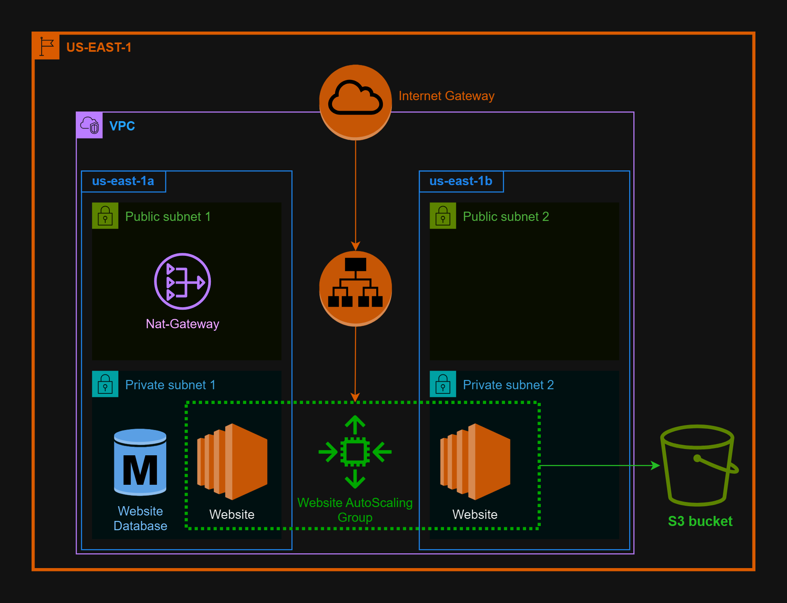
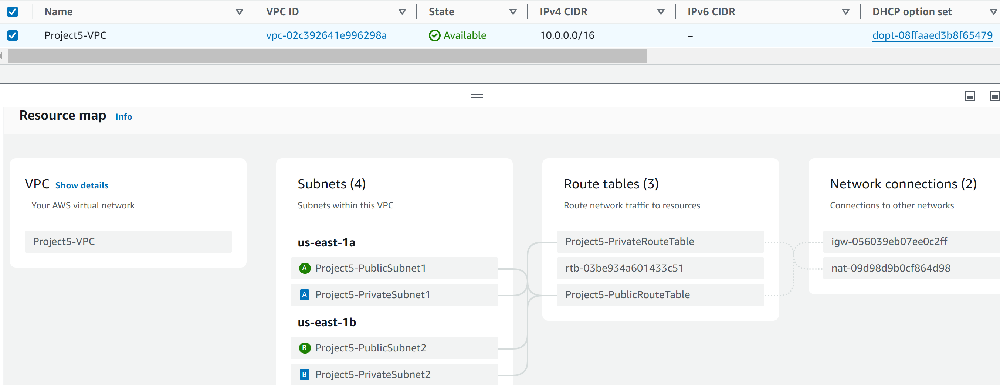
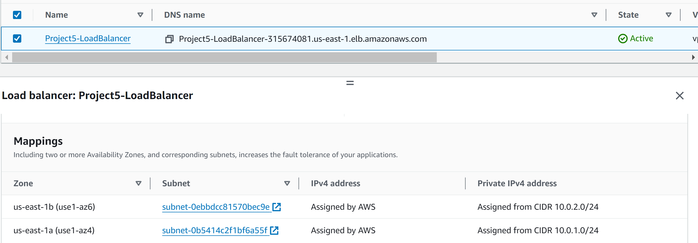
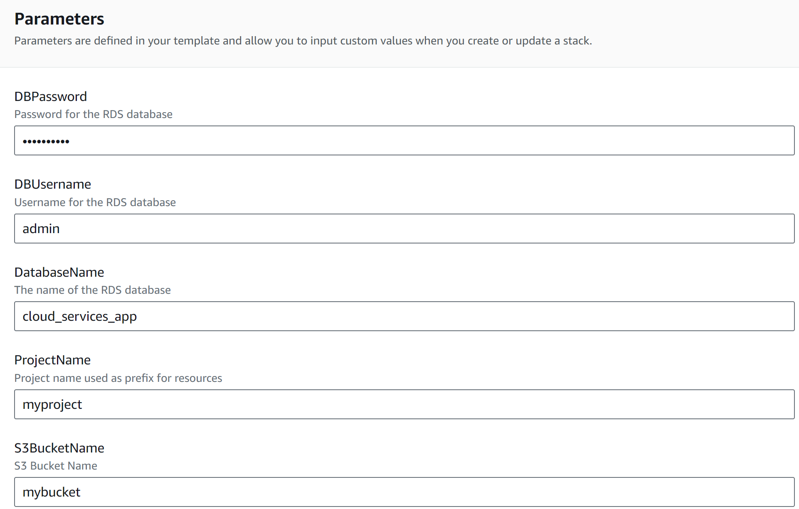
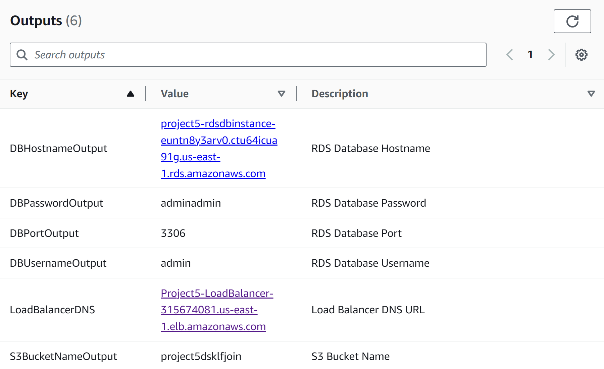
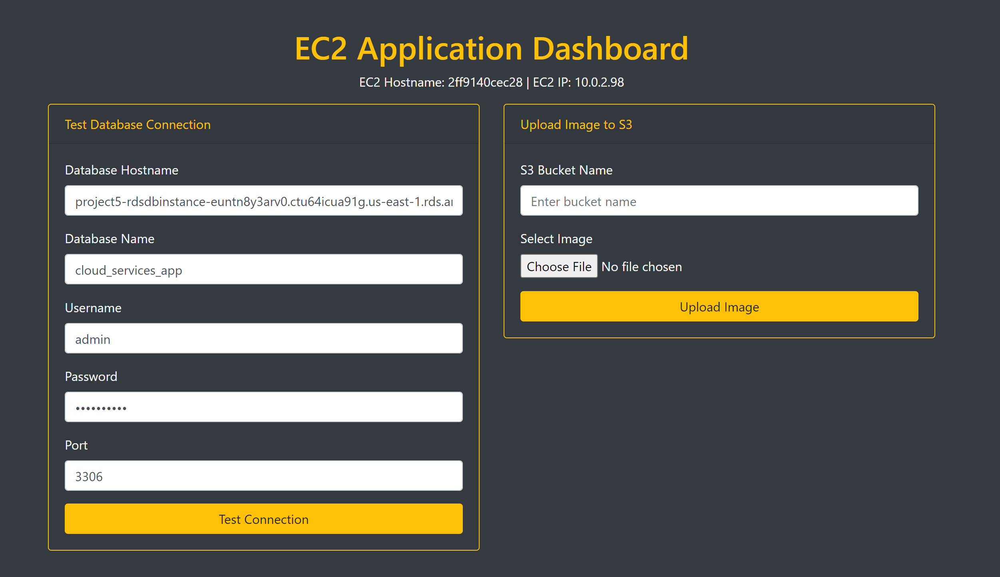
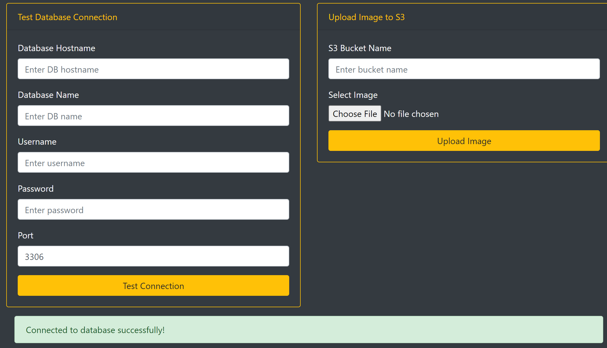

# AWS CloudFormation Template - VPC, Auto Scaling, RDS, S3, and Load Balancer

## Description
This AWS CloudFormation template deploys a complete infrastructure on AWS, which includes the following:
- A Virtual Private Cloud (VPC) with 2 public and 2 private subnets.
- An Internet Gateway and Route Tables for public access.
- A NAT Gateway for private subnets.
- Security Groups for EC2 and RDS instances.
- A Load Balancer for distributing traffic.
- An RDS MySQL instance.
- An S3 bucket for file storage.
- Auto Scaling Group with EC2 instances behind the Load Balancer.
- IAM roles and policies for EC2 to interact with S3.

## Parameters

The following parameters are defined in the template:

| Parameter       | Description                            | Default Value    |
|-----------------|----------------------------------------|------------------|
| `ProjectName`   | Project name used as prefix for resources. | `myproject` |
| `DBUsername`    | Username for the RDS database.          | `admin`          |
| `DBPassword`    | Password for the RDS database.          | `adminadmin`     |
| `DatabaseName`  | Name of the RDS database.               | `cloud_services_app` |
| `S3BucketName`  | Name of the S3 bucket.                 | `mybucket`       |

## Resources Created

### VPC and Subnets
- A VPC with the CIDR block `10.0.0.0/16`.
- Two public subnets and two private subnets spread across two Availability Zones.
- Route tables and route table associations for both public and private subnets.


### Networking
- Internet Gateway for public internet access.
- NAT Gateway for internet access from private subnets.



## Security Groups

The CloudFormation template creates three distinct security groups, each with specific rules to control inbound and outbound traffic for the EC2 instances, RDS, and Load Balancer. These rules ensure secure communication between components and external access to the application.

### 1. **EC2 Security Group**
   - **Purpose**: Controls traffic for EC2 instances in the Auto Scaling Group.
   - **Inbound Rules**:
     - Allows SSH access for management.
     - Allows HTTP access from the Load Balancer.
   - **Outbound Rules**:
     - Allows all outbound traffic from EC2 to external services.

### 2. **RDS Security Group**
   - **Purpose**: Controls traffic for the MySQL RDS instance.
   - **Inbound Rules**:
     - Allows MySQL access only from EC2 instances within the VPC.
   - **Outbound Rules**:
     - Allows all outbound traffic from the RDS instance.

### 3. **Load Balancer Security Group**
   - **Purpose**: Controls traffic for the Elastic Load Balancer.
   - **Inbound Rules**:
     - Allows HTTP traffic from the internet (0.0.0.0/0).
   - **Outbound Rules**:
     - Allows traffic to EC2 instances.

### Security Group Rules Table

| **Security Group**           | **Type**     | **Direction** | **Protocol** | **Port Range** | **Source**               | **Description**                                                |
|------------------------------|--------------|---------------|--------------|----------------|--------------------------|----------------------------------------------------------------|
| **EC2 Security Group**        | Inbound      | SSH           | TCP          | 22             | `0.0.0.0/0`               | Allows SSH access for EC2 management.                          |
|                              | Inbound      | HTTP          | TCP          | 80             | Load Balancer SG          | Allows HTTP traffic from the Load Balancer.                    |
|                              | Outbound     | All Traffic   | All          | All            | `0.0.0.0/0`               | Allows all outbound traffic from EC2 instances.                |
| **RDS Security Group**        | Inbound      | MySQL         | TCP          | 3306           | EC2 SG                    | Allows MySQL access from EC2 instances within the VPC.         |
|                              | Outbound     | All Traffic   | All          | All            | `0.0.0.0/0`               | Allows all outbound traffic from the RDS instance.             |
| **Load Balancer Security Group** | Inbound   | HTTP          | TCP          | 80             | `0.0.0.0/0`               | Allows HTTP traffic from the internet.                         |
|                              | Outbound     | All Traffic   | All          | All            | EC2 SG                    | Allows HTTP traffic to EC2 instances in the Auto Scaling Group.|

### Security Group Code Block

```yaml
# EC2 Security Group
EC2SecurityGroup:
  Type: AWS::EC2::SecurityGroup
  Properties: 
    GroupDescription: Allow SSH and HTTP access to EC2 instances
    VpcId: !Ref VPC
    SecurityGroupIngress:
      - IpProtocol: tcp
        FromPort: 22
        ToPort: 22
        CidrIp: 0.0.0.0/0  # SSH Access from anywhere
      - IpProtocol: tcp
        FromPort: 80
        ToPort: 80
        SourceSecurityGroupId: !Ref LoadBalancerSecurityGroup  # HTTP Access from Load Balancer
    SecurityGroupEgress:
      - IpProtocol: -1
        FromPort: -1
        ToPort: -1
        CidrIp: 0.0.0.0/0  # Allow all outbound traffic

# RDS Security Group
RDSSecurityGroup:
  Type: AWS::EC2::SecurityGroup
  Properties: 
    GroupDescription: Allow MySQL access from EC2 instances
    VpcId: !Ref VPC
    SecurityGroupIngress:
      - IpProtocol: tcp
        FromPort: 3306
        ToPort: 3306
        SourceSecurityGroupId: !Ref EC2SecurityGroup  # MySQL Access from EC2 instances
    SecurityGroupEgress:
      - IpProtocol: -1
        FromPort: -1
        ToPort: -1
        CidrIp: 0.0.0.0/0  # Allow all outbound traffic

# Load Balancer Security Group
LoadBalancerSecurityGroup:
  Type: AWS::EC2::SecurityGroup
  Properties:
    GroupDescription: Allow HTTP traffic to the Load Balancer
    VpcId: !Ref VPC
    SecurityGroupIngress:
      - IpProtocol: tcp
        FromPort: 80
        ToPort: 80
        CidrIp: 0.0.0.0/0  # HTTP Access from the internet
    SecurityGroupEgress:
      - IpProtocol: -1
        FromPort: -1
        ToPort: -1
        CidrIp: 0.0.0.0/0  # Allow all outbound traffic
```

### Load Balancer
- An internet-facing Elastic Load Balancer (ELB) for distributing traffic to EC2 instances in the Auto Scaling Group.
- Target Group and Listener for the Load Balancer.



### RDS
- MySQL RDS instance with a defined username, password, and database name.
- RDS Subnet Group to ensure the RDS instance runs in the private subnets.


### Auto Scaling Group
- Auto Scaling Group with EC2 instances using a Launch Template.
- EC2 instances will be placed behind the Load Balancer.

### S3
- S3 bucket for storing files, accessible by the EC2 instances.

### IAM Roles and Instance Profile
- An IAM Role with an S3 access policy to allow EC2 instances to interact with the S3 bucket.
- IAM Instance Profile for attaching the role to EC2 instances.

## How to Deploy

1. **Navigate to the AWS CloudFormation Console**:
   - Go to the AWS Management Console and open the [CloudFormation](https://console.aws.amazon.com/cloudformation) service.

2. **Create a New Stack**:
   - Select **Create Stack** and choose **With new resources (standard)**.
   - Upload the CloudFormation template file or paste the template into the editor.

3. **Provide Input Parameters**:
   - You will be prompted to provide the following parameters during stack creation:
     - `ProjectName`: Prefix for resources (e.g., `myproject`).
     - `DBUsername`: Username for the RDS database (default: `admin`).
     - `DBPassword`: Password for the RDS database (default: `adminadmin`).
     - `DatabaseName`: Name of the database (default: `cloud_services_app`).
     - `S3BucketName`: Name of the S3 bucket (default: `mybucket`).

     

4. **Review and Deploy**:
   - Review the details and acknowledge that CloudFormation might create IAM resources.
   - Click **Create Stack** to start the deployment process.

5. **Monitor the Stack**:
   - You can monitor the creation of resources in the **Events** tab of the stack in the CloudFormation Console.
   - Once the stack status is `CREATE_COMPLETE`, your infrastructure will be ready.

## Resources that were created
## Resources Table

| **Logical ID**                         | **Physical ID**                                                                                       | **Type**                                      | **Status**          |
|----------------------------------------|-------------------------------------------------------------------------------------------------------|-----------------------------------------------|---------------------|
| **EC2AutoScalingGroup**                | Project5-EC2AutoScalingGroup-apFEqwE45LMU                                                              | AWS::AutoScaling::AutoScalingGroup            | CREATE_COMPLETE     |
| **EC2InstanceProfile**                 | Project5-EC2InstanceProfile-UFb1BJ8uRY2p                                                               | AWS::IAM::InstanceProfile                     | CREATE_COMPLETE     |
| **EC2Role**                            | Project5-EC2Role-hsPoDvB3UMNx                                                                          | AWS::IAM::Role                                | CREATE_COMPLETE     |
| **EC2SecurityGroup**                   | sg-0d14231320801222f                                                                                   | AWS::EC2::SecurityGroup                       | CREATE_COMPLETE     |
| **InternetGateway**                    | igw-056039eb07ee0c2ff                                                                                  | AWS::EC2::InternetGateway                     | CREATE_COMPLETE     |
| **LaunchTemplate**                     | lt-09ba5f2a9db713ae7                                                                                   | AWS::EC2::LaunchTemplate                      | CREATE_COMPLETE     |
| **LoadBalancer**                       | arn:aws:elasticloadbalancing:us-east-1:528757812128:loadbalancer/app/Project5-LoadBalancer/d592d7d0c1e1bbe1 | AWS::ElasticLoadBalancingV2::LoadBalancer     | CREATE_COMPLETE     |
| **LoadBalancerListener**               | arn:aws:elasticloadbalancing:us-east-1:528757812128:listener/app/Project5-LoadBalancer/d592d7d0c1e1bbe1/dcd6cf5dc901b935 | AWS::ElasticLoadBalancingV2::Listener         | CREATE_COMPLETE     |
| **LoadBalancerSecurityGroup**          | sg-0508d9ac842809468                                                                                   | AWS::EC2::SecurityGroup                       | CREATE_COMPLETE     |
| **LoadBalancerTargetGroup**            | arn:aws:elasticloadbalancing:us-east-1:528757812128:targetgroup/Project5-TargetGroup/21724a75a43d95db   | AWS::ElasticLoadBalancingV2::TargetGroup      | CREATE_COMPLETE     |
| **NATGateway**                         | nat-09d98d9b0cf864d98                                                                                  | AWS::EC2::NatGateway                          | CREATE_COMPLETE     |
| **NATGatewayEIP**                      | 34.200.7.229                                                                                           | AWS::EC2::EIP                                 | CREATE_COMPLETE     |
| **PrivateRoute**                       | rtb-00c901695cdc11d4e|0.0.0.0/0                                                                       | AWS::EC2::Route                               | CREATE_COMPLETE     |
| **PrivateRouteTable**                  | rtb-00c901695cdc11d4e                                                                                  | AWS::EC2::RouteTable                          | CREATE_COMPLETE     |
| **PrivateSubnet1**                     | subnet-055792d061868627a                                                                               | AWS::EC2::Subnet                              | CREATE_COMPLETE     |
| **PrivateSubnet2**                     | subnet-02dee8b98580f12aa                                                                               | AWS::EC2::Subnet                              | CREATE_COMPLETE     |
| **PrivateSubnetRouteTableAssociation1**| rtbassoc-097443b8a3d2016dc                                                                             | AWS::EC2::SubnetRouteTableAssociation         | CREATE_COMPLETE     |
| **PrivateSubnetRouteTableAssociation2**| rtbassoc-04967b60d05a7a17e                                                                             | AWS::EC2::SubnetRouteTableAssociation         | CREATE_COMPLETE     |
| **PublicRoute**                        | rtb-0612474e55af37a60|0.0.0.0/0                                                                     | AWS::EC2::Route                               | CREATE_COMPLETE     |
| **PublicRouteTable**                   | rtb-0612474e55af37a60                                                                                  | AWS::EC2::RouteTable                          | CREATE_COMPLETE     |
| **PublicSubnet1**                      | subnet-0b5414c2f1bf6a55f                                                                               | AWS::EC2::Subnet                              | CREATE_COMPLETE     |
| **PublicSubnet2**                      | subnet-0ebbdcc81570bec9e                                                                               | AWS::EC2::Subnet                              | CREATE_COMPLETE     |
| **PublicSubnetRouteTableAssociation1** | rtbassoc-056557b93ff3cc778                                                                             | AWS::EC2::SubnetRouteTableAssociation         | CREATE_COMPLETE     |
| **PublicSubnetRouteTableAssociation2** | rtbassoc-061f0bc1c046faedd                                                                             | AWS::EC2::SubnetRouteTableAssociation         | CREATE_COMPLETE     |
| **RDSDBInstance**                      | project5-rdsdbinstance-euntn8y3arv0                                                                    | AWS::RDS::DBInstance                          | CREATE_COMPLETE     |
| **RDSDBSubnetGroup**                   | project5-rdsdbsubnetgroup-a52dgwy0fezs                                                                 | AWS::RDS::DBSubnetGroup                       | CREATE_COMPLETE     |
| **RDSSecurityGroup**                   | sg-01b1dcc70e37698ae                                                                                   | AWS::EC2::SecurityGroup                       | CREATE_COMPLETE     |
| **S3Bucket**                           | project5dsklfjoin                                                                                      | AWS::S3::Bucket                               | CREATE_COMPLETE     |
| **VPC**                                | vpc-02c392641e996298a                                                                                  | AWS::EC2::VPC                                 | CREATE_COMPLETE     |
| **VPCGatewayAttachment**               | IGW|vpc-02c392641e996298a                                                                              | AWS::EC2::VPCGatewayAttachment                | CREATE_COMPLETE     |


## Outputs

After successful stack creation, the following key resources will be available:

- **Private Subnet IDs**: The IDs of the private subnets.
- **Load Balancer DNS**: The DNS address of the Load Balancer for accessing the application.
- **RDS Endpoint**: The endpoint of the RDS database for database connections.





# Flask Application

This Flask application, running on an EC2 instance, provides a basic interface to test two main functionalities in your AWS infrastructure:

First we Dockerize it push it to ecr in a public repository and making then using bash script we are installing the application in cloudformation code

```bash
 #!/bin/bash
sudo apt update -y
sudo apt install -y docker.io
sudo systemctl start docker
sudo systemctl enable docker
sudo docker run -d -p 80:5000 public.ecr.aws/l2u5d2v6/webapp
```

1. **RDS Database Connectivity**: Check if the EC2 instance can successfully connect to an RDS instance.
2. **S3 File Upload**: Validate if the EC2 instance has the correct IAM roles and policies for uploading files to an S3 bucket.

## Application Overview

The application is structured with two primary features:

### 1. RDS Database Connection Test
This functionality allows you to input RDS instance details such as the database hostname, name, user credentials, and port. Upon submitting these details, the application attempts to establish a connection to the RDS instance.

- **Input fields**:
  - `Database Hostname`: The endpoint of your RDS instance.
  - `Database Name`: The name of the database to connect to.
  - `Username`: The username for the RDS database.
  - `Password`: The password for the RDS user.
  - `Port`: The port number for the RDS instance (default is 3306).
## SUCCESSFUL CONNECTION 

- **Expected outcome**: 
  - On success: A success message will appear indicating a successful connection to the RDS instance.
  - On failure: An error message will display the reason for the connection failure, helping you troubleshoot any networking or RDS configuration issues.

This process checks the **network connectivity** between the EC2 instance and the RDS instance.

### 2. S3 File Upload Test
This functionality allows you to upload a file to an S3 bucket. You need to provide the S3 bucket name and select a file from your local machine.

- **Input fields**:
  - `S3 Bucket Name`: The name of the S3 bucket where the file will be uploaded.
  - `File`: The file you want to upload.

  

- **Expected outcome**:
  - On success: A success message will appear with a link to the uploaded file in the S3 bucket.
  - On failure: An error message will display the reason for the upload failure.

This test helps verify that the EC2 instance has the correct **IAM roles and policies** assigned to allow file uploads to the S3 bucket.

## Infrastructure Validation

- **RDS Validation**: By successfully connecting to the RDS instance from the EC2 instance, you validate that:
  - The VPC settings (security groups, subnets) for both EC2 and RDS allow communication.
  - The RDS instance is reachable from the EC2 instance through the specified network configurations.

- **S3 IAM Role Validation**: By uploading a file to S3, you verify that:
  - The IAM role assigned to the EC2 instance has the necessary permissions to upload files to S3.
  - The EC2 instance can interact with the S3 service via the assigned IAM role.

